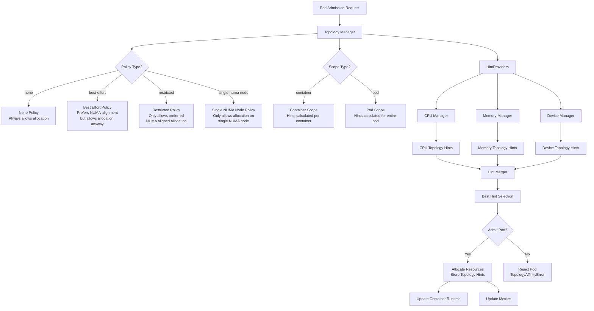

# usingCursorAI
As a telco partner architect, my role often requires to complex Openshift-related technical questions, ranging from network protocols to infrastructure, and cloud-native architectures. The ability to delve into the underlying code of systems and applications can often provide an unparalleled level of insight.

Rather than using Cursor AI to write code I will use this tool to demistify complex codebases. In cloud-native telco systems different components interact in complex ways. The goal is to understand whether Cursor AI can help me to quickly architect and troubleshoot solutions more effectively, being able to quickly comprehend relevant code sections. We are gonna try to answer this question with a practical example. How can CursorAI help me to understand the details on how openshift Topology Manager works?

## An Example: How does Topology Manager works? 

First impression: It writes diagrams from code!
[Architecture Overview](imgs/arch.png)

<figcaption class="figure-caption text-center">

**Figure 1** Topology manager Architecture.

</figcaption>

### Architecture Overview

